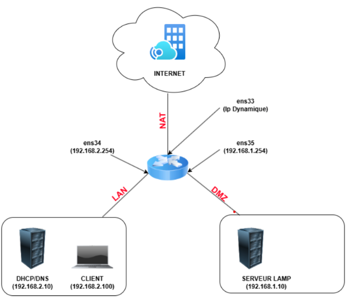

# 🌦️ Collecte de données météorologiques – Mairie de Bordeaux

Ce projet consiste à mettre en place une **infrastructure réseau complète**, un **serveur web**, un **site internet** et une **base de données** pour la collecte et la visualisation de données météorologiques **en temps réel**, au service de la **Mairie de Bordeaux**.

---

## 🧩 Contexte du projet

Ce projet a été réalisé dans le cadre d’une étude d’infrastructure numérique, avec les objectifs suivants :

- Déployer un réseau de sondes météo (Andernos-les-Bains)
- Mettre en place un **serveur LAMP** sécurisé dans une **DMZ**
- Mettre en place un **Routeur** 
- Créer un **site web de visualisation des données**
- Assurer la communication via un serveur **DHCP/DNS**
- Transmettre les données météo à la **Mairie de Bordeaux** en temps réel

---

## 🖥️ Architecture de l’infrastructure

  

**Composants clés :**

- 📡 **Sondes météo** (Andernos)
- 📡 **Routeur** 
- 🌐 **Serveur web LAMP** (Apache + PHP + MySQL)
- 🛡️ **DMZ sécurisée**  
- 🧭 **Serveur DHCP/DNS**  
- 🏛️ **Client final : Mairie de Bordeaux**

---

## 🌐 Site web & base de données

- Site responsive développé en HTML/CSS/JavaScript
- Données stockées en base **MySQL**
- Affichage en temps réel via requêtes API (OpenWeather)
- Transimission des données API du Frontend à **Node.js** 
- Interface simple pour consultation par les agents de la mairie
- 

## ⚙️ Technologies utilisées

- 🔵 HTML / CSS / JavaScript
- 🐘 PHP 8.x
- 🐬 MySQL / MariaDB
- 🐧 Debian
- 🔐 iptables / DMZ / DNS / DHCP
- 🖥️ VM Ware
- 🟢 Node.js
- 📊 JSON pour la transmission des données

---

## 🔒 Sécurité

- Isolation des services en DMZ
- Pare-feu configuré (iptables)
- Accès restreint par IP et mot de passe pour la base de données
- Stockage sécurisé des données
- Logs d’accès journalisés

---

## 📬 Contact

**Réalisé pour :** Mairie de Bordeaux  
**Responsable technique :**  Gaudry SERI  
📧 Email : gaudryregnier@gmail.com

© 2025 – Tous droits réservés.

